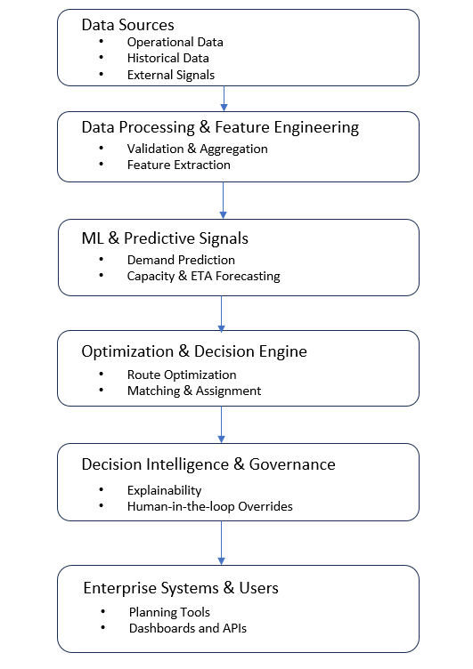

# AI‑Driven Route Optimization & Decision Intelligence for Large‑Scale Logistics

This repository presents my proposed endeavor and body of work focused on building
AI‑driven optimization and decision intelligence systems for large‑scale logistics
and transportation networks.

## Proposed Endeavor

My proposed endeavor is to design, build, and operationalize AI‑driven route
optimization and decision intelligence systems that improve efficiency, reliability,
and scalability of large‑scale logistics and transportation networks in the United States.

This work focuses on replacing static, rule‑based planning systems with data‑driven,
adaptive optimization and predictive intelligence that can operate in real‑world,
high‑volume, time‑critical environments.

### Focus Areas

- Route optimization under real‑world constraints
- Machine learning–augmented decision support systems
- Predictive analytics for logistics operations
- Scalable enterprise integration of AI systems
- Human‑in‑the‑loop and override‑safe optimization

## Problem Statement

Large‑scale logistics networks rely heavily on static heuristics and manual planning,
which struggle to adapt to dynamic operational conditions such as fluctuating demand,
capacity changes, and real‑time disruptions.

These limitations result in:
- Suboptimal route utilization
- Increased operational costs
- Poor scalability as networks grow
- Delayed decision‑making under uncertainty

## Solution Approach

My work introduces a hybrid optimization framework that combines:

- Algorithmic optimization techniques (matching, heuristics, simulations)
- Machine learning for prediction and decision intelligence
- Enterprise‑grade system design to support real‑time operations

This approach enables intelligent, explainable, and scalable route planning systems
that operate continuously in production environments.

## Impact and Significance

The systems and methodologies represented here directly contribute to:

- Improved efficiency of transportation and logistics infrastructure
- Reduced fuel usage and operating costs
- Increased scalability and resiliency of supply chains
- Faster, data‑driven decision‑making at enterprise scale

Such improvements have broad implications beyond a single organization and are
relevant to national transportation efficiency, supply chain reliability, and
economic productivity.

## System Architecture Overview

The diagram below presents a generalized, technology‑agnostic architecture
for AI‑driven route optimization and decision intelligence systems.
The architecture is intentionally abstracted to avoid company‑specific
implementations while highlighting core technical concepts.

### Architecture Layers

**Data Sources**
- Historical and operational logistics data
- Resource availability and network constraints
- External signals such as demand patterns or traffic indicators

**Data Processing & Feature Engineering**
- Data validation and normalization
- Feature extraction and aggregation
- Time‑series preparation for predictive modeling

**Machine Learning & Predictive Signals**
- Demand and volume forecasting
- Pickup and capacity prediction
- Constraint and risk estimation

**Optimization & Decision Engine**
- Route optimization algorithms
- Matching and assignment heuristics
- Constraint‑aware scenario evaluation

**Decision Intelligence & Governance**
- Explainability and confidence scoring
- Human‑in‑the‑loop decision overrides
- Monitoring, auditability, and traceability

**Enterprise Systems & Users**
- Planning and operations tools
- Dashboards and reporting interfaces
- Integration with enterprise platforms

## Representative Technical Work

The following repositories represent key components of my technical background
that support this endeavor:

### Machine Learning & Recommender Systems
- [Music‑Map – Music Recommendation System (Python)](https://github.com/basundharadey/Music-Map)

### Optimization Algorithms
- [Stable Matching / Hospital‑Intern Matching (C)](https://github.com/basundharadey/Implement-Stable-Marriage-Algoritm-On-Hospital-Intern-Match)

### Systems & Architecture Optimization
- [Cache Efficiency via Dead Block Elimination (C)](https://github.com/basundharadey/Increase-Cache-Efficiency-By-Dead-Block-Elimination-Using-Trace-Based-Mechanism)

## Why I Am Well‑Positioned to Advance This Endeavor

I bring a unique combination of:

- Over a decade of experience building enterprise‑scale operational systems
- Hands‑on leadership in route optimization and logistics platforms
- Applied machine learning deployment in production environments
- Technical depth across optimization, systems architecture, and data modeling

This combination enables me to translate theoretical models into scalable,
real‑world systems with measurable operational impact.
